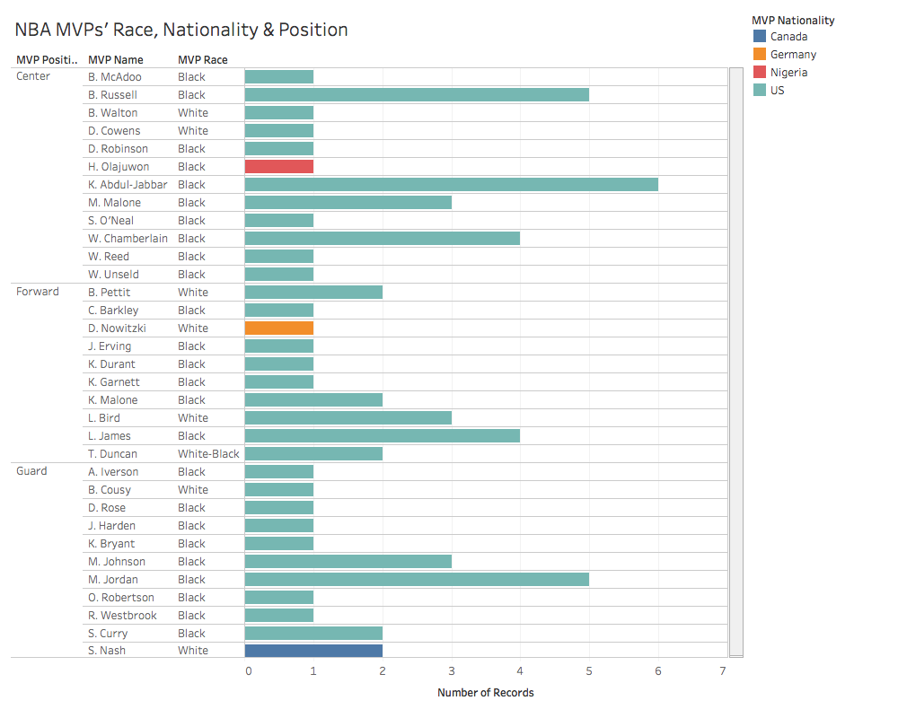

# Initial Findings

In this section, I have made visualization for the different datasets that I used for my research.

---

In this visualization of NBA players, I have used a dataset created by Gabe Salzer and Selene Arrazolo to see the correlation of the number of NBA players and their races to which states produce the most NBA players. The NBA is known to have a significantly larger number of blacks athletes, however through this dataset I realized that the states that produce the most blacks often produce the most NBA players. According to blackdemographics.com (http://blackdemographics.com/population/black-state-population/), the states that have the greatest number of blacks were southern and eastern states, and California. This visualization also shows that southern and eastern states and California has produced the greatest number of NBA players.

---

In this visualization, I used a dataset created by Gabe Salzer to show the result of the global marketing of the NBA post-Michael Jordan era by showing the total number of attendances each team had and the amount of money each NBA team generated in a span of fifteen years. From the year 2000 to 2015, the number of fans and money the NBA has generated consistantly increased, allowing the NBA to become one of the most wealthy sports league. This visualization shows that there have been a total of 334,094,544 home games attendances between 2000 and 2015 during the regular NBA season, not including the playoffs. The average ticket for a NBA game is about $80, this means that between 2000 and 2015 the NBA generated a total of $26,727,563,520 from home game attendances, not including the sales of merchandise and playoff tickets the NBA also generated. The amount of money the NBA generated is a direct result of the global market that the NBA became during the times of NBA legends such as Bill Russell, Wilt Chamberlain, Kareem Abdul-Jabbar, Larry Bird, Magic Johnson, Hakeem Olajuwon and Michael Jordan.

---

---

---

---
