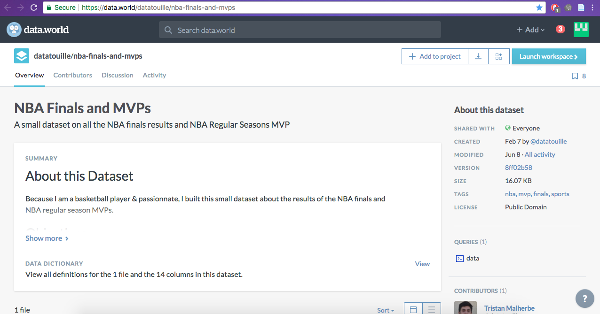

# Workflow
	
When I first began gathering data I initially had eight datasets that I wanted to gather data from. However, I narrowed down the number of sources to the three that were the most significant to my research.

The first source I gathered data from focused on the NBA players' birthplaces in the United States. This dataset is titled 'NBA Players' Birthplaces,' and was created by Gabe Salzer and Selene Arrazolo on data.world. I chose to use this dataset because I wanted to see the correlation between NBA players' birthplaces in the United States and the races of NBA players, such as if this state has a higher black population, did this state produce more NBA players? As this source already had a dataset created in Microsoft Excel, I just directly downloaded the source and did not webscrape it or change anything in it via OpenRefine.

The second dataset focused on the amount of attendance per game for each NBA team from 2000 to 2015. This source is titled 'NBA Team Annual Attendance,' also created by Gabe Salzer on data.world. I chose to use this source in order to see the result of the growth of the NBA via it's fan post-Michael Jordan era, and during the Kobe Bryant and LeBron James era. With this, I will be able to see how much money the NBA has generated throughout the years. As this dataset was posted on data.world, I just directly downloaded it as a Microsoft Excel file, and did not have to webscrape it, nor did I have to change anything in the file via OpenRefine.

The last source was created by Tristan Malherbe on data.world, was titled 'NBA Finals and MVPS,' and centered around the NBA's MVPs, NBA champions, and NBA Finals MVPs. Although I did not have to webscrape this source, as I directly downloaded this source as a Microsoft Excel file, I did have to add some things to this file but not using OpenRefine. I added a section titled 'Finals MVPs' and added two other sections to it that stated the race of each season's MVP and each Finals' MVP. Therefore, I chose to use this source in order to see whether or not a certain race had more MVPs and Finals MVPs.

After I finished gathering and analyzing the data from these three sources, I created visuals for each dataset using Tableau (found on the 'Initial Findings' tab). I chose to use Tableau to visualize my data because it was the program that I felt most comfortable using, and the program that I felt I could be the most creative with in showing my viewers my points of argument.
